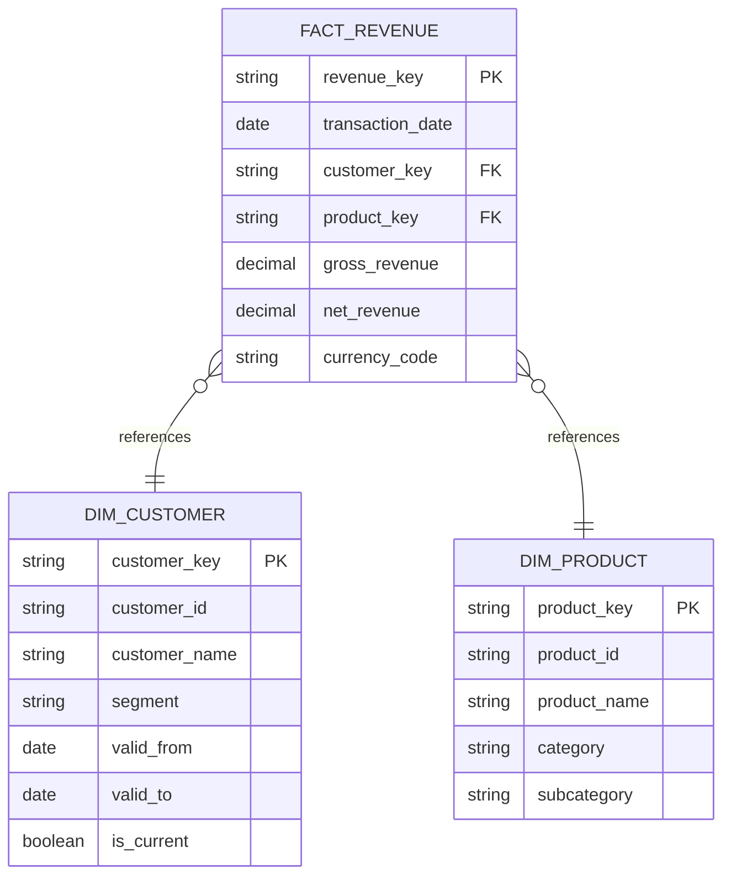

# Data Engineering Best Practices
## Modern Data Lakehouse Stack (Snowflake / Databricks / Legacy)

**Document Owner:** Chief Data Office  
**Domain:** Data Engineering  
**Version:** 1.0  
**Classification:** Internal — Program Standard

---

## Table of Contents

1. [Guiding Philosophy](#1-guiding-philosophy)
2. [Cloud Infrastructure Standards](#2-cloud-infrastructure-standards)
3. [Authentication & Access Practices](#3-authentication--access-practices)
4. [Cluster Choice & Lifecycle Management](#4-cluster-choice--lifecycle-management)
5. [Medallion Architecture](#5-medallion-architecture)
6. [Metadata Standards & ERD Practices](#6-metadata-standards--erd-practices)
7. [Governed Tagging](#7-governed-tagging)
8. [Semantic Layer Development](#8-semantic-layer-development)
9. [Object & Config-Based Practices](#9-object--config-based-practices)
10. [Pipeline Design Standards](#10-pipeline-design-standards)
11. [Testing & Data Quality](#11-testing--data-quality)
12. [Observability & Lineage](#12-observability--lineage)

---

## 1. Guiding Philosophy

All data engineering practices must embody three core principles:

| Principle | Definition |
|-----------|------------|
| **Repeatable** | Every pipeline, schema, and transformation can be re-executed from source with consistent results. |
| **Configurable** | Platform, environment, and business rules are externalized into config files — never hardcoded. |
| **Auditable** | Every object, transformation, and access event produces a traceable record. |

> **CDO Mandate:** No pipeline reaches production without a corresponding config manifest, data contract, and lineage record.

---

## 2. Cloud Infrastructure Standards

### 2.1 Platform Selection Matrix

| Capability | Snowflake | Databricks | Legacy (On-Prem / Other Cloud DW) |
|---|---|---|---|
| Structured SQL workloads | ✅ Primary | ✅ Supported | ✅ Supported |
| ML / Unstructured data | ⚠️ Limited | ✅ Primary | ❌ Not recommended |
| Streaming ingestion | ⚠️ Snowpipe | ✅ Structured Streaming | ⚠️ Varies |
| Cost model | Per-credit (compute) | DBU-based | Fixed / licensed |
| Governance surface | Native RBAC + data sharing | Unity Catalog | Manual / varies |

### 2.2 Infrastructure-as-Code (IaC) Requirements

All cloud infrastructure **must** be provisioned via IaC. No manual console provisioning in non-sandbox environments.

**Required toolchain:**
- **Terraform** — primary IaC for cloud resources (VPCs, IAM, storage accounts, private endpoints)
- **Snowflake Terraform Provider** — warehouses, databases, schemas, roles, grants
- **Databricks Terraform Provider** — clusters, jobs, secrets, Unity Catalog objects
- **Python-based config manifests** — `YAML` / `TOML` driven, version controlled in Git

```yaml
# Example: environment_config.yaml
environment: production
platform: snowflake
account: myorg-prod
region: us-east-1
warehouse:
  name: TRANSFORM_WH
  size: LARGE
  auto_suspend: 120
  auto_resume: true
  max_cluster_count: 3
database:
  name: PROD_DB
  data_retention_days: 90
```

### 2.3 Network & Connectivity

- All platform access must route through **private endpoints** (AWS PrivateLink / Azure Private Link).
- No public internet exposure for data platform endpoints in production.
- Use **IP allowlisting** as a secondary control, not a primary one.
- All egress from compute (Databricks clusters, Snowflake external functions) must pass through an **egress proxy or VPC NAT gateway**.
- Storage accounts (S3, ADLS, GCS) must enforce **bucket/container policies** to restrict access to platform service principals only.

### 2.4 Environment Tiering

```
dev  →  staging/qa  →  prod
```

- Each environment is a **separate Snowflake account** or **separate Databricks workspace**.
- Promotion between environments is managed via CI/CD pipeline — no manual object creation in staging or prod.
- Config files parameterize all environment-specific values (account names, warehouse sizes, role names).

---

## 3. Authentication & Access Practices

### 3.1 Identity Standards

| Auth Method | Allowed Environments | Notes |
|---|---|---|
| SSO / SAML (Okta, Azure AD) | All | Required for human users |
| OAuth 2.0 (service accounts) | All | Required for pipeline service accounts |
| Username + Password | Dev only | Must rotate every 90 days; no shared credentials |
| Key-pair auth (RSA) | All (Snowflake) | Required for all Snowflake service accounts |
| PAT (Personal Access Token) | Dev only | Databricks; must set expiry |
| Service Principal + Secret | All (Databricks) | Secrets stored in secrets manager only |

### 3.2 Secrets Management

**Rule: Zero secrets in code.** All credentials, tokens, and connection strings must be externalized.

**Approved stores:**
- **AWS Secrets Manager** / **Azure Key Vault** — cloud-native secrets
- **Databricks Secrets** — scoped secrets for cluster/job use
- **HashiCorp Vault** — enterprise cross-cloud secret brokering

```python
# Pattern: retrieve secret at runtime — never hardcode
import boto3
import json

def get_secret(secret_name: str, region: str = "us-east-1") -> dict:
    client = boto3.client("secretsmanager", region_name=region)
    response = client.get_secret_value(SecretId=secret_name)
    return json.loads(response["SecretString"])

# Usage
snowflake_creds = get_secret("prod/snowflake/service_account")
```

### 3.3 Role-Based Access Control (RBAC)

#### Snowflake Role Hierarchy (Standard)

```
ACCOUNTADMIN
  └── SYSADMIN
        ├── DB_ADMIN_{ENV}         # DDL rights per environment
        ├── TRANSFORM_ROLE_{ENV}   # DML on staging/transform schemas
        ├── ANALYST_ROLE_{ENV}     # SELECT on curated/semantic schemas
        └── LOADER_ROLE_{ENV}      # INSERT/COPY into raw schemas only
```

#### Databricks Unity Catalog Privilege Hierarchy

```
Account Admin
  └── Metastore Admin
        ├── Catalog Owner  (CREATE SCHEMA, CREATE TABLE)
        ├── Data Engineer  (READ VOLUME, CREATE TABLE, MODIFY)
        ├── Data Analyst   (SELECT on gold/semantic catalogs)
        └── ML Engineer    (SELECT + CREATE MODEL in ml catalog)
```

**Principles:**
- Roles are granted to **groups**, never to individual users directly.
- Service accounts receive the **minimum privilege** needed for the task.
- Role definitions are maintained in Terraform/IaC — any grant outside IaC triggers a drift alert.

---

## 4. Cluster Choice & Lifecycle Management

### 4.1 Databricks Cluster Types

| Cluster Type | Use Case | Auto-Terminate | Config Approach |
|---|---|---|---|
| **Job Cluster** | Production pipelines | Always (job-scoped) | Defined in job JSON/YAML |
| **All-Purpose Cluster** | Development / exploration | Yes (≤ 30 min idle) | Defined in cluster policy |
| **SQL Warehouse (Serverless)** | BI / ad hoc SQL | Managed by platform | Defined in warehouse config |
| **Single Node** | Unit testing / small jobs | Yes (≤ 15 min idle) | Dev only |

**Rule:** Production pipelines **must** use Job Clusters. All-purpose clusters must never be used for scheduled production workloads.

### 4.2 Cluster Policies (Databricks)

All clusters must be governed by a **Cluster Policy** — no unconstrained cluster creation outside dev sandboxes.

```json
{
  "spark_version": {
    "type": "allowlist",
    "values": ["14.3.x-scala2.12", "15.4.x-scala2.12"],
    "defaultValue": "15.4.x-scala2.12"
  },
  "node_type_id": {
    "type": "allowlist",
    "values": ["m5d.xlarge", "m5d.2xlarge", "m5d.4xlarge"]
  },
  "autoscale.min_workers": {
    "type": "range",
    "minValue": 1,
    "maxValue": 4
  },
  "autoscale.max_workers": {
    "type": "range",
    "minValue": 2,
    "maxValue": 20
  },
  "autotermination_minutes": {
    "type": "range",
    "minValue": 10,
    "maxValue": 60,
    "defaultValue": 30
  }
}
```

### 4.3 Snowflake Warehouse Sizing Standards

| Workload Type | Warehouse Size | Auto-Suspend | Multi-Cluster |
|---|---|---|---|
| ELT / Transformation | LARGE | 120s | Yes (max 3) |
| Ad Hoc Analytics | MEDIUM | 60s | No |
| BI Tool Queries | SMALL-MEDIUM | 60s | Yes (max 5) |
| Data Loading (Snowpipe) | Serverless | N/A | N/A |
| ML Feature Extraction | X-LARGE | 300s | No |

**Rule:** Warehouse size is defined in config and enforced via Terraform. Any resize request requires change management approval.

### 4.4 Lifecycle Tagging

Every cluster and warehouse must carry the following tags:

```yaml
tags:
  owner: "data-engineering-team"
  environment: "production"
  cost_center: "CC-1042"
  project: "core-platform"
  managed_by: "terraform"
  auto_terminate: "true"
```

---

## 5. Medallion Architecture

### 5.1 Layer Definitions

```
Source Systems
      │
      ▼
┌─────────────────────────────────────────┐
│  BRONZE (Raw / Landing)                 │
│  • Exact copy of source                 │
│  • Schema-on-read                       │
│  • Append-only; no deletes              │
│  • Retained per data retention policy   │
└─────────────────┬───────────────────────┘
                  │
                  ▼
┌─────────────────────────────────────────┐
│  SILVER (Cleansed / Conformed)          │
│  • Validated, typed, deduplicated       │
│  • Standardized naming conventions      │
│  • PII tokenized / masked               │
│  • SCD Type 2 history maintained        │
└─────────────────┬───────────────────────┘
                  │
                  ▼
┌─────────────────────────────────────────┐
│  GOLD (Curated / Business-Ready)        │
│  • Aggregated, enriched, joined         │
│  • Business definitions applied         │
│  • Optimized for analytical consumption │
│  • Governed semantic layer objects      │
└─────────────────────────────────────────┘
```

### 5.2 Naming Conventions

**Snowflake:**
```
{ENV}_{DOMAIN}_{LAYER}
  e.g., PROD_FINANCE_BRONZE
        PROD_FINANCE_SILVER
        PROD_FINANCE_GOLD
```

**Databricks Unity Catalog:**
```
{env}_{domain}_{layer}  (catalog)
  └── {source_system}   (schema)
        └── {entity}    (table)

e.g., prod_finance_bronze.erp.gl_transactions
      prod_finance_silver.erp.gl_transactions_clean
      prod_finance_gold.finance.general_ledger
```

### 5.3 Layer-Specific Rules

#### Bronze Layer
- Data is written **exactly as received** — no transformations.
- Source system metadata appended: `_ingested_at`, `_source_system`, `_batch_id`, `_file_name` (if file-based).
- Use **Delta Lake** (Databricks) or **VARIANT** type (Snowflake) for semi-structured sources.
- Enforce **schema evolution policies** — additive changes allowed, breaking changes require review.

#### Silver Layer
- All columns have defined data types — no loose VARCHAR/STRING for structured fields.
- Nullability rules documented in data contract.
- Apply **data quality rules** (not null, referential integrity, range checks).
- Maintain **`_valid_from` / `_valid_to` / `_is_current`** for SCD2 entities.
- PII fields masked or tokenized before any downstream read.

#### Gold Layer
- Objects represent **business concepts**, not system tables.
- Naming reflects business vocabulary (e.g., `fact_revenue`, `dim_customer`).
- Aggregations use **materialized views** (Snowflake) or **Delta materialized tables** (Databricks).
- All gold objects must have an associated **data contract** and **semantic layer definition**.

### 5.4 Delta Lake / Iceberg Optimization (Databricks)

```python
# Standard optimization pattern — run post-load or on schedule
from delta.tables import DeltaTable
from pyspark.sql import SparkSession

def optimize_delta_table(
    spark: SparkSession,
    catalog: str,
    schema: str,
    table: str,
    zorder_cols: list[str] | None = None
) -> None:
    full_name = f"{catalog}.{schema}.{table}"
    dt = DeltaTable.forName(spark, full_name)
    
    if zorder_cols:
        spark.sql(f"OPTIMIZE {full_name} ZORDER BY ({', '.join(zorder_cols)})")
    else:
        spark.sql(f"OPTIMIZE {full_name}")
    
    # Vacuum with retention guard
    dt.vacuum(retentionHours=168)  # 7-day default; override via config

# Config-driven usage
optimize_delta_table(
    spark=spark,
    catalog="prod_finance_gold",
    schema="finance",
    table="fact_revenue",
    zorder_cols=["transaction_date", "customer_id"]
)
```

---

## 6. Metadata Standards & ERD Practices

### 6.1 Required Metadata for Every Table

Every table/view in the data platform must carry the following metadata:

| Metadata Field | Source | Required |
|---|---|---|
| `description` | Data contract | ✅ |
| `owner` | Team registry | ✅ |
| `domain` | Domain taxonomy | ✅ |
| `data_classification` | Data governance policy | ✅ |
| `source_system` | Lineage metadata | ✅ |
| `layer` | Bronze/Silver/Gold | ✅ |
| `refresh_frequency` | Pipeline config | ✅ |
| `data_retention_days` | Retention policy | ✅ |
| `pii_contains` | Privacy assessment | ✅ |
| `created_date` | System generated | ✅ |
| `last_modified_date` | System generated | ✅ |

### 6.2 Column-Level Metadata

Every column must have:
- `description` — plain English business definition
- `data_type` — declared type
- `nullable` — true/false
- `pii_type` — (if applicable): `name`, `email`, `ssn`, `phone`, `address`, `financial`
- `classification_tag` — from governed tag taxonomy

### 6.3 ERD Standards

- ERDs are maintained in code using **dbdiagram.io DSL** or **Mermaid ERD syntax**, version-controlled in Git.
- Every Gold domain must have a published ERD in the data catalog.
- ERD must reflect **current production state** — updated as part of the deployment checklist.



---

## 7. Governed Tagging

### 7.1 Tag Taxonomy

Tags must be applied consistently using the approved taxonomy. Tags are **not** free-form text.

#### Data Classification Tags

| Tag | Definition | Handling Requirement |
|---|---|---|
| `PUBLIC` | Non-sensitive, shareable externally | None |
| `INTERNAL` | Internal use only | Access logging |
| `CONFIDENTIAL` | Restricted to specific roles | Encrypted at rest + in transit |
| `RESTRICTED` | Regulatory / PII / financial | Masking + audit trail + RBAC |
| `TOP_SECRET` | Board / M&A / executive | Separate vault, no analytics access |

#### PII Tags

```
PII_NAME, PII_EMAIL, PII_PHONE, PII_ADDRESS, PII_SSN,
PII_DOB, PII_FINANCIAL, PII_HEALTH, PII_BIOMETRIC
```

#### Domain Tags

```
DOMAIN_FINANCE, DOMAIN_HR, DOMAIN_SALES, DOMAIN_MARKETING,
DOMAIN_OPERATIONS, DOMAIN_CUSTOMER, DOMAIN_PRODUCT, DOMAIN_RISK
```

### 7.2 Snowflake Tag Implementation

```sql
-- Create governed tags (run once, managed by IaC)
CREATE TAG IF NOT EXISTS governance.tags.data_classification
    ALLOWED_VALUES 'PUBLIC', 'INTERNAL', 'CONFIDENTIAL', 'RESTRICTED', 'TOP_SECRET';

CREATE TAG IF NOT EXISTS governance.tags.pii_type
    ALLOWED_VALUES 'PII_NAME', 'PII_EMAIL', 'PII_PHONE', 'PII_SSN', 'PII_DOB', 'NONE';

CREATE TAG IF NOT EXISTS governance.tags.domain
    ALLOWED_VALUES 'DOMAIN_FINANCE', 'DOMAIN_HR', 'DOMAIN_SALES', 'DOMAIN_CUSTOMER';

-- Apply to table and column
ALTER TABLE prod_finance_gold.finance.dim_customer
    SET TAG governance.tags.data_classification = 'RESTRICTED',
            governance.tags.domain = 'DOMAIN_CUSTOMER';

ALTER TABLE prod_finance_gold.finance.dim_customer
    MODIFY COLUMN email
    SET TAG governance.tags.pii_type = 'PII_EMAIL';
```

### 7.3 Databricks Unity Catalog Tag Implementation

```python
# Config-driven tag application
tag_config = {
    "catalog": "prod_finance_gold",
    "schema": "finance",
    "table": "dim_customer",
    "table_tags": {
        "data_classification": "RESTRICTED",
        "domain": "DOMAIN_CUSTOMER",
        "owner": "finance-data-team",
        "pii_contains": "true"
    },
    "column_tags": {
        "email": {"pii_type": "PII_EMAIL"},
        "full_name": {"pii_type": "PII_NAME"},
        "ssn": {"pii_type": "PII_SSN"}
    }
}

def apply_tags(spark, config: dict) -> None:
    full_table = f"{config['catalog']}.{config['schema']}.{config['table']}"
    
    for tag_key, tag_val in config["table_tags"].items():
        spark.sql(f"ALTER TABLE {full_table} SET TAGS ('{tag_key}' = '{tag_val}')")
    
    for col, col_tags in config["column_tags"].items():
        for tag_key, tag_val in col_tags.items():
            spark.sql(
                f"ALTER TABLE {full_table} ALTER COLUMN {col} "
                f"SET TAGS ('{tag_key}' = '{tag_val}')"
            )
```

---

## 8. Semantic Layer Development

### 8.1 Purpose & Principles

The semantic layer translates physical data model objects into **business-consumable, governed definitions**. It is the contract between the data engineering team and business consumers.

**Tools:**
- **dbt** — primary transformation and semantic layer framework
- **Snowflake Semantic Layer** / **Cortex Analyst** — Snowflake-native consumption
- **Databricks AI/BI Genie** — Databricks-native semantic layer
- **Looker / Tableau / Power BI** — BI-layer semantics (metrics defined here should mirror dbt)

### 8.2 dbt Standards

```
project/
├── dbt_project.yml          # Project config — environment-parameterized
├── profiles.yml             # Connection profiles (secrets via env vars)
├── models/
│   ├── bronze/              # Raw source staging models
│   ├── silver/              # Cleansed, conformed models
│   └── gold/                # Business-ready, semantic models
│       ├── finance/
│       │   ├── _finance_models.yml   # Schema + tests + metadata
│       │   ├── fact_revenue.sql
│       │   └── dim_customer.sql
├── tests/                   # Custom data tests
├── macros/                  # Reusable SQL macros
├── seeds/                   # Reference data
└── snapshots/               # SCD2 snapshots
```

**Every dbt model must have:**

```yaml
# _finance_models.yml
version: 2

models:
  - name: fact_revenue
    description: "Grain: one row per revenue transaction. Measures gross and net revenue."
    meta:
      owner: "finance-data-team"
      domain: "DOMAIN_FINANCE"
      layer: "gold"
      data_classification: "CONFIDENTIAL"
      refresh_frequency: "daily"
    columns:
      - name: revenue_key
        description: "Surrogate key — SHA256 hash of transaction_id + source_system."
        tests:
          - unique
          - not_null
      - name: gross_revenue
        description: "Pre-discount, pre-tax revenue amount in USD."
        tests:
          - not_null
          - dbt_utils.accepted_range:
              min_value: 0
```

### 8.3 Semantic Metrics (dbt Metrics Layer)

```yaml
# metrics/finance_metrics.yml
metrics:
  - name: gross_revenue
    label: "Gross Revenue"
    model: ref('fact_revenue')
    description: "Total gross revenue before discounts and taxes."
    type: sum
    sql: gross_revenue
    timestamp: transaction_date
    time_grains: [day, week, month, quarter, year]
    dimensions:
      - customer_segment
      - product_category
      - region
    filters:
      - field: is_voided
        operator: "="
        value: "false"
```

---

## 9. Object & Config-Based Practices

### 9.1 Config-First Design Pattern

All pipeline behavior is externalized to config. The pipeline code reads config — it does not contain business logic inline.

```yaml
# pipeline_config.yaml — version controlled, environment-parameterized
pipeline:
  name: finance_gl_ingestion
  version: "2.1.0"
  environment: "{{ ENV }}"        # Injected at runtime
  schedule: "0 2 * * *"          # 2 AM UTC daily

source:
  type: jdbc
  connection_secret: "{{ ENV }}/jdbc/erp_finance"
  database: FINANCE_DB
  schema: GL
  table: TRANSACTIONS
  watermark_column: UPDATED_AT
  watermark_state_store: "s3://config-store/watermarks/finance_gl.json"

destination:
  platform: snowflake
  account_secret: "{{ ENV }}/snowflake/service_account"
  database: "{{ ENV | upper }}_FINANCE_BRONZE"
  schema: ERP
  table: GL_TRANSACTIONS
  write_mode: append              # append | overwrite | merge
  merge_keys: ["TRANSACTION_ID", "SOURCE_SYSTEM"]

quality_checks:
  not_null: ["TRANSACTION_ID", "TRANSACTION_DATE", "AMOUNT"]
  accepted_range:
    AMOUNT: { min: -9999999, max: 9999999 }
  row_count_threshold:
    min_rows: 100
    max_variance_pct: 50          # Alert if row count changes >50% vs prior run

notifications:
  on_failure:
    - type: slack
      channel: "#data-alerts-prod"
    - type: pagerduty
      severity: high
  on_sla_breach:
    - type: email
      to: ["data-engineering@company.com"]
```

### 9.2 Python Pipeline Base Class Pattern

```python
# base_pipeline.py — reusable, config-driven base

import yaml
import logging
from abc import ABC, abstractmethod
from pathlib import Path
from typing import Any

class BasePipeline(ABC):
    """
    Base class for all data pipelines.
    All pipelines extend this class and implement extract(), transform(), load().
    Config is loaded from YAML — zero hardcoding allowed.
    """

    def __init__(self, config_path: str, env: str = "dev"):
        self.env = env
        self.config = self._load_config(config_path)
        self.logger = self._setup_logging()

    def _load_config(self, config_path: str) -> dict:
        with open(config_path) as f:
            raw = f.read().replace("{{ ENV }}", self.env)
            return yaml.safe_load(raw)

    def _setup_logging(self) -> logging.Logger:
        logging.basicConfig(
            level=logging.INFO,
            format="%(asctime)s | %(levelname)s | %(name)s | %(message)s"
        )
        return logging.getLogger(self.config["pipeline"]["name"])

    @abstractmethod
    def extract(self) -> Any:
        """Extract data from source system."""
        pass

    @abstractmethod
    def transform(self, raw_data: Any) -> Any:
        """Apply transformations to raw data."""
        pass

    @abstractmethod
    def load(self, transformed_data: Any) -> None:
        """Load data to destination."""
        pass

    def run(self) -> None:
        """Orchestrated execution with logging and error handling."""
        self.logger.info(f"Pipeline start: {self.config['pipeline']['name']} v{self.config['pipeline']['version']}")
        try:
            raw = self.extract()
            transformed = self.transform(raw)
            self.load(transformed)
            self.logger.info("Pipeline completed successfully.")
        except Exception as e:
            self.logger.error(f"Pipeline failed: {e}", exc_info=True)
            raise
```

---

## 10. Pipeline Design Standards

### 10.1 Idempotency

Every pipeline must be **idempotent** — running it multiple times with the same input produces the same output.

- Use **MERGE** (upsert) patterns for Silver and Gold loads.
- Use **append-only + deduplication** for Bronze.
- Never rely on row count or timestamp alone as a deduplication key.

### 10.2 Incremental Loading

```python
# Watermark-based incremental load pattern
def get_watermark(state_store_path: str, default: str = "1900-01-01") -> str:
    """Read last processed watermark from state store."""
    import json, boto3
    s3 = boto3.client("s3")
    bucket, key = state_store_path.replace("s3://", "").split("/", 1)
    try:
        obj = s3.get_object(Bucket=bucket, Key=key)
        return json.loads(obj["Body"].read())["last_watermark"]
    except s3.exceptions.NoSuchKey:
        return default

def save_watermark(state_store_path: str, watermark: str) -> None:
    """Persist watermark after successful load."""
    import json, boto3
    s3 = boto3.client("s3")
    bucket, key = state_store_path.replace("s3://", "").split("/", 1)
    s3.put_object(Bucket=bucket, Key=key, Body=json.dumps({"last_watermark": watermark}))
```

### 10.3 Error Handling & Dead Letter Queue

- All pipeline failures write to a **dead letter table** with full context (batch ID, error message, row-level detail).
- No silent failures — every exception is logged, alerted, and surfaced in the observability layer.

---

## 11. Testing & Data Quality

### 11.1 Testing Pyramid

```
                    ┌─────────────────┐
                    │  E2E / Contract │  ← Data contracts, SLA tests
                    ├─────────────────┤
                  ┌─┴─────────────────┴─┐
                  │  Integration Tests   │  ← Full pipeline, schema validation
                  ├──────────────────────┤
                ┌─┴──────────────────────┴─┐
                │     Unit Tests            │  ← Transform logic, SQL unit tests
                └───────────────────────────┘
```

### 11.2 Required Tests Per Layer

| Test Type | Bronze | Silver | Gold |
|---|---|---|---|
| Row count > 0 | ✅ | ✅ | ✅ |
| Schema validation | ✅ | ✅ | ✅ |
| Not null (key columns) | ✅ | ✅ | ✅ |
| Uniqueness (PK) | — | ✅ | ✅ |
| Referential integrity | — | ✅ | ✅ |
| Accepted ranges | — | ✅ | ✅ |
| Freshness SLA | ✅ | ✅ | ✅ |
| Business rule validation | — | — | ✅ |

### 11.3 Great Expectations Integration

```python
# Standard GE checkpoint pattern — config driven
import great_expectations as gx

def run_quality_checkpoint(
    context_path: str,
    checkpoint_name: str,
    batch_params: dict
) -> bool:
    context = gx.get_context(context_root_dir=context_path)
    result = context.run_checkpoint(
        checkpoint_name=checkpoint_name,
        batch_request=batch_params
    )
    return result.success
```

---

## 12. Observability & Lineage

### 12.1 Required Audit Columns

Every table in Silver and Gold must include:

```sql
_batch_id          VARCHAR    -- Unique pipeline run ID (UUID)
_source_system     VARCHAR    -- Source system name from config
_ingested_at       TIMESTAMP  -- When the record was written to Bronze
_processed_at      TIMESTAMP  -- When the record was written to this layer
_pipeline_version  VARCHAR    -- Pipeline code version (git tag)
_is_deleted        BOOLEAN    -- Soft delete flag (default FALSE)
```

### 12.2 Lineage Tooling

| Tool | Platform | Function |
|---|---|---|
| **OpenLineage / Marquez** | Open source | Column-level lineage capture |
| **Snowflake Access History** | Snowflake native | Object + column access lineage |
| **Unity Catalog Lineage** | Databricks native | Table + column lineage |
| **dbt lineage graph** | dbt | Transformation lineage |

### 12.3 Monitoring Checklist

- [ ] Pipeline run duration vs baseline (alert on >2x baseline)
- [ ] Row count vs prior run (alert on >50% variance unless configured)
- [ ] Data freshness vs SLA (alert on breach)
- [ ] Failed quality checks (alert immediately)
- [ ] Warehouse/cluster cost vs budget (daily alert)
- [ ] Unused warehouse/cluster auto-terminate confirmed

---

## Appendix A — Quick Reference: Standards at a Glance

| Standard | Rule |
|---|---|
| Secrets | Never in code; always in secrets manager |
| IaC | All resources provisioned via Terraform |
| Environments | Dev → Staging → Prod; no manual prod changes |
| Cluster type | Job clusters for production; all-purpose for dev only |
| Naming | `{env}_{domain}_{layer}` for databases/catalogs |
| Metadata | Every table has owner, classification, domain, refresh frequency |
| Tags | Governed taxonomy only; no free-form tags |
| Testing | Every pipeline has unit, integration, and quality tests |
| Lineage | Every object registered in catalog with lineage |
| Audit columns | `_batch_id`, `_ingested_at`, `_processed_at`, `_pipeline_version` on all Silver/Gold |

---

*Document controlled by the Chief Data Office. Changes require approval from the Data Engineering Lead and Data Governance Lead.*
